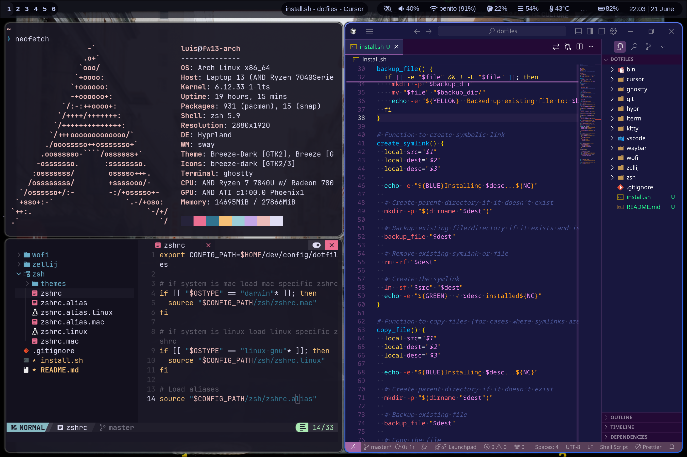

# 🐧 h4ch3 — Dotfiles (ThinkPad P53)



Colección de archivos de configuración personales para un entorno productivo en Arch Linux,
optimizados específicamente para el Lenovo ThinkPad P53. Combina la potencia de **Hyprland**
con la estética dinámica de **Wallust** (colores generados desde el wallpaper).

> [!WARNING]
> Usa estos scripts bajo tu propio riesgo. Revisa `install.sh` antes de ejecutarlo.
> Los archivos existentes se respaldan automáticamente en `~/.dotfiles_backup/`.

---

## ✨ Stack

| Componente | Herramienta |
|---|---|
| WM | Hyprland + hyprlock + hypridle |
| Terminal | Ghostty |
| Shell | Zsh modular + Starship |
| Bar | Waybar (con scripts VPN / target) |
| Launcher | Wofi |
| Colores | Wallust (dinámico desde wallpaper) |
| Monitor de sistema | btop |

---

## 💻 Hardware objetivo (P53)

- **GPU**: Nvidia Quadro RTX 3000 — variables de entorno ajustadas para Hyprland (Optimus / nvidia-dkms)
- **CPU**: Intel Core i7-9850H — balance rendimiento/batería
- **RAM**: 64 GB
- **Pantalla**: eDP-1 con soporte para monitores externos

---

## 🛠️ Requisitos

**Base:**
```
zsh  git  starship  hyprland  hyprlock  hypridle  waybar  wofi  wallust  ghostty
```

**Opcionales:**
```
btop  fastfetch  neovim  zellij
```

---

## 📦 Instalación

```bash
# Clonar en el directorio estándar
mkdir -p ~/dev/config
git clone https://github.com/h4ch3-h4ck/dotfiles.git ~/dev/config/dotfiles

# Instalar
cd ~/dev/config/dotfiles
chmod +x install.sh
./install.sh
```

El script detecta tu OS, crea symlinks y respalda cualquier config existente.

---

## 📂 Estructura

```
.
├── btop/        # Config del monitor de sistema
├── ghostty/     # Terminal (config + tema Wallust)
├── git/         # Configuración global de Git
├── hypr/        # Hyprland, Hyprlock, Hypridle
├── starship/    # Prompt (tema Tokyo Night)
├── waybar/      # Barra de estado + scripts (VPN, target)
├── wofi/        # Launcher + estilos CSS
├── zsh/         # Shell modular (alias globales, alias Linux)
├── install.sh   # Script de instalación con symlinks
└── pkglist.txt  # Lista de paquetes del sistema
```

---

## 🎨 Wallust — Colores dinámicos

[Wallust](https://codeberg.org/explosion-mental/wallust) genera el esquema de colores desde tu wallpaper y lo aplica automáticamente a Ghostty, Waybar e Hyprland.

Los templates están en las subcarpetas `wallust/` de cada componente, por ejemplo:
`hypr/wallust/wallust-hyprland.conf`

---

## 🙏 Créditos

Empezó como fork de la plantilla de [luismendozamx](https://github.com/luismendozamx),
evolucionado para adaptarse al hardware P53 y mi flujo de trabajo personal.

---

## 📄 Licencia

MIT — copia, modifica y comparte libremente.
